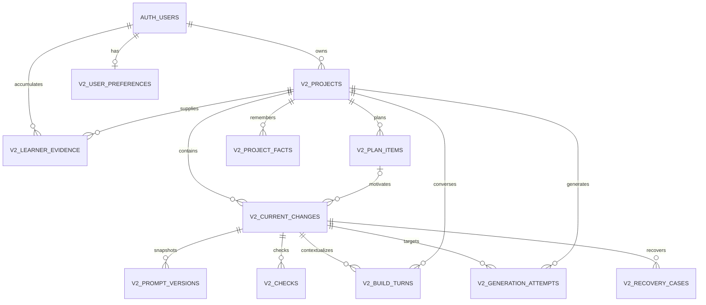

# Codize V2 Schema and Persistence Design

## Status and authority

**Document type:** Canonical V2 physical-schema and persistence design.

**Milestone:** V2.1 — documentation and schema design only.

**Implementation status:** The V2.2 additive migration and local database verifier are implemented in the repository. They are not applied or deployed, and no V2 backend route, frontend surface, cutover, or external integration is implemented. Verified deployment evidence remains required before treating any remote database as migrated.

**Authority:** This document implements the [Codize V2 Technical Architecture and State Model](codize_v2_technical_architecture.md). The [Product Thesis](codize_v2_product_thesis.md), [Exact UX Specification](codize_v2_exact_ux_specification.md), and [Character System Blueprint](codize_v2_character_system_blueprint.md) remain higher authority in their scopes. If this document conflicts with them or with the Technical Architecture, the higher source wins and this design must be corrected.

**Final-review physical clarifications:** The accepted V2.1 blocker resolution makes four earlier architecture shorthands exact for V2.2 persistence: append-oriented Evidence permits the controlled privacy transition in 6.10/12; Recovery mutations serialize through and increment the Current Change version instead of requiring a separate expected-Recovery token at completion; completion's full lock order includes the optional Recovery Case after the optional Plan Item; and retry returns current canonical persisted state rather than reconstructing an unpersisted old response. These are concurrency/privacy precision fixes within the same entity cut, not new product behavior.

**Canonical entity cut:** The MVP contains exactly the eleven `public.v2_*` tables named below. This document chooses the physical PostgreSQL shape that V2.2 should implement. Changes to entity meaning, ownership, lifecycle, or compatibility require an accepted architecture amendment; mechanical improvements that preserve those contracts may be handled during reviewed DDL implementation.

## 1. Decisions fixed by this package

1. V2 is a separate domain. It does not reuse or reinterpret V1 `projects`, `task_progress`, `workflow_artifacts`, `gate_sessions`, or `unlocks`.
2. Every project-scoped API and database operation uses an explicit V2 project ID and the owner identity derived from the verified access token.
3. The browser uses Supabase for Auth only. It has no direct Data API access to any V2 product table or internal V2 function.
4. The schema is relational first. JSONB is limited to a bounded setup draft and bounded typed Build-turn presentation payloads; neither is project truth after acceptance.
5. History is a derived read over terminal structured rows. There is no History table or copied completion aggregate.
6. Project Facts are an allowlisted, typed, provenance-preserving memory model, not an arbitrary claim graph.
7. Learner Evidence is append-oriented product state and remains separate from telemetry. Here, append-oriented means that ordinary observations are inserted rather than rewritten; it still permits the narrowly controlled, versioned status and privacy-minimization mutations defined in 6.10 and 12.
8. Mutable aggregates use optimistic versions. Retry-sensitive operations use operation-local UUID command IDs.
9. Completion is backend-only and atomic through one PostgreSQL transaction. Under the current PostgREST transport, that transaction is exposed only as a locked-down internal RPC.
10. Physical project purge cascades through project-scoped rows only after user-level preferences and surviving learner evidence have been cleared or minimized deliberately.

## 2. PostgreSQL conventions

### 2.1 Target and naming

- Target: the repository's current PostgreSQL 17 / Supabase environment.
- Schema: `public`, with the canonical `v2_` prefix on every MVP product table and internal V2 function.
- Primary IDs and command IDs: `uuid`; row IDs default to `gen_random_uuid()` and command IDs are supplied by the trusted backend.
- Timestamps: `timestamptz`, server-authored in UTC semantics, normally `not null default now()`.
- Versions: `bigint not null default 1 check (version > 0)`; every successful state-changing command increments each mutable row it changes by exactly `+ 1`. A stale expected version fails, and an idempotent no-op replay does not increment a version.
- Human-entered and generated content is bounded in bytes with `octet_length`, not only in characters.
- Enum-like domains use lower-snake-case `text`/`varchar` plus named `check` constraints. PostgreSQL native enums are not used because policy values will evolve and native-enum migrations are unnecessarily rigid.
- All foreign-key and index names use `v2_<table>_<purpose>_{fk|key|idx}`.

### 2.2 Shared ownership keys

`v2_projects` owns `(id, owner_user_id)` as a unique key. Every project-scoped child stores both `project_id` and `owner_user_id` and uses a composite foreign key to that pair. This deliberately redundant owner column provides three protections:

- a child row cannot be attached to another user's project;
- every backend repository can constrain owner and explicit project in the same predicate;
- future non-bypass-RLS backend roles can express owner policies without an ownership join.

Each project-scoped table also exposes a unique `(id, project_id, owner_user_id)` key where another child needs to prove same-project ownership through a composite foreign key.

`owner_user_id` references `auth.users(id) on delete restrict` on the three user-root tables: `v2_projects`, `v2_learner_evidence`, and `v2_user_preferences`. `restrict` is intentional: account deletion must run the ordered V2 deletion process before deleting the Auth row. Project children inherit ownership through their composite project foreign key and do not need an independent Auth foreign key.

### 2.3 Bounded-content defaults

These are the canonical V2.1 limits for initial DDL. V2.2 may lower a limit after fixtures demonstrate that the smaller bound is sufficient; raising one requires a data-safety review.

| Content class | Maximum stored bytes |
|---|---:|
| display label, key, or reason key | 256 |
| short student/project summary | 4 KiB |
| observation, explanation, or recovery detail | 16 KiB |
| accepted prompt or mutable prompt draft | 64 KiB |
| Build-turn content | 32 KiB |
| setup draft JSONB | 16 KiB |
| Build-turn structured payload JSONB | 16 KiB |
| text-list fact value | 8 KiB total, at most 32 entries |

The API may enforce smaller endpoint-specific limits. Database checks are the last integrity boundary, not the only validation.

### 2.4 Shared mutation behavior

Mutable tables use V2-specific transition/version guards. The application supplies `expected_version`; the SQL predicate or function verifies it, applies a legal transition, and supplies `NEW.version = OLD.version + 1`. A surviving row's semantic state-changing update is rejected unless its version is exactly `OLD.version + 1`, and a timestamp trigger sets `updated_at = now()`. Neither trigger silently manufactures the version increment on behalf of an application command.

The enumerated `on delete set null` actions in 12.3 are referential cleanup, not application commands. Version/immutability enforcement is transaction-aware: an FK cleanup may leave the semantic version unchanged only when that referencing row is also deleted by the same transaction. If the referencing row will survive, the owning retention/detach command must first clear the pointer through its controlled expected-version update (and increment exactly once), after which deletion finds the FK already null. For example, Generation Attempt expiry first version-updates a surviving Prompt Version to clear its operational origin; whole-Project purge may let the FK clear rows that disappear before commit. V2.2 implements the end-of-transaction distinction with deferred constraint guards and tests both cases. This avoids both an optimistic-concurrency bypass and cascade-order dependence.

`v2_current_changes.prompt_draft_version` follows the same exactness rule independently: it is unchanged when `prompt_draft IS NOT DISTINCT FROM OLD.prompt_draft`, and it must equal `OLD.prompt_draft_version + 1` when the draft actually changes. A command that changes other Current Change fields must not advance the draft version.

Append-oriented content is protected in two layers:

- application repositories expose inserts and narrowly named status/redaction commands rather than arbitrary updates;
- DDL transition triggers reject changes to immutable snapshots after their allowed one-time transition.

For Learner Evidence, these layers admit only optimistic status changes and the one-way privacy-minimization transition. They do not permit an ordinary observation to be edited in place.

No provider call, GitHub call, analytics call, or other network operation occurs while a database transaction or row lock is open.

## 3. Controlled value sets

The following checks belong in V2.2 DDL. API enums mirror these strings exactly.

| Domain | Values |
|---|---|
| project lifecycle | `draft`, `temporary_recovery`, `active`, `archived`, `deletion_pending` |
| project setup resume | `idea_capture`, `first_version_shaping`, `guided_resistance`, `plan_proposal`, `existing_project_context`, `recovery_context`, `ready` |
| plan scope | `first_version`, `later` |
| plan status | `proposed`, `ready`, `deferred`, `done`, `removed` |
| change kind | `build`, `recovery` |
| change lifecycle | `preparing`, `awaiting_agent`, `reviewing`, `recovering`, `completed`, `cancelled` |
| change resume step | `confirm_change`, `choose_agent`, `intervention`, `prompt`, `effort`, `return_outcome`, `check`, `inspect`, `understand`, `recovery_symptom`, `recovery_investigate`, `recovery_correct`, `recovery_recheck` |
| prompt purpose | `feature`, `diagnostic`, `correction` |
| effort | `quick`, `standard`, `deep` |
| teaching mode | `skip`, `ask`, `remind`, `teach` |
| risk | `normal`, `slowdown` |
| check requirement | `required`, `waived` |
| support level | `none`, `nudge`, `clue`, `teach` |
| return outcome | `worked`, `broken`, `unsure` |
| check source | `codize`, `student` |
| check status | `proposed`, `performed`, `not_run` |
| check result | `worked`, `partly_worked`, `did_not_work`, `unsure` |
| fact source | `student_stated`, `student_observed`, `agent_claimed`, `repository_observed`, `system_observed`, `codize_inferred` |
| fact status | `active`, `unresolved`, `contradicted`, `stale`, `superseded` |
| fact value kind | `text`, `boolean`, `number`, `text_list` |
| fact source record | `build_turn`, `current_change`, `prompt_version`, `check`, `recovery_case`, and later `repository_observation` |
| confirmation | `unreviewed`, `confirmed`, `rejected` |
| turn speaker | `student`, `codize`, `system` |
| turn kind | `mentor_question`, `student_answer`, `student_decision`, `student_override`, `help_nudge`, `help_clue`, `help_teach`, `generated_explanation`, `return_report`, `recovery_observation`, `safe_failure`, `system_note` |
| turn retention | `structured`, `raw_short`, `sensitive_short` |
| generation status | `pending`, `succeeded`, `failed`, `superseded` |
| generation purpose | `setup_summary`, `first_version_proposal`, `plan_proposal`, `intervention_copy`, `prompt_draft`, `recovery_summary`, `diagnostic_prompt`, `correction_prompt`, `concept_explanation`, `project_answer` |
| recovery status | `open`, `investigating`, `correcting`, `rechecking`, `resolved`, `abandoned` |
| last-known-working certainty | `yes`, `no`, `unsure` |
| learner elicitation | `spontaneous`, `asked`, `after_hint`, `taught` |
| learner evidence status | `active`, `retracted`, `invalidated` |
| learner evidence source record | `build_turn`, `check`, `recovery_case`, `current_change`, `minimized` |
| motion preference | `system`, `full`, `reduced` |

The initial Project Fact type allowlist is:

```text
project_goal
first_version_scope
saved_for_later
known_working_behavior
constraint
boundary
tech_stack
tool
unresolved_behavior
```

The initial Learner Evidence competency allowlist is:

```text
first_version_scoping
define_done
protect_working_behavior
effort_selection
inspect_changes
testing
debugging
causal_explanation
functions
state
events
api
database
authentication
client_server
persistence
async_work
validation
error_handling
data_ownership
rendering
routing
dependencies
version_control
```

Adding a fact type or competency requires a versioned policy/config change and a matching forward migration or allowlist table decision. The MVP does not accept arbitrary user-provided keys.

## 4. Relationship model



The diagram shows semantic relationships. Same-owner/same-project composite foreign keys are required even where the simplified diagram shows only one line.

## 5. Exposure model

“Client-readable” below means eligible for a safe FastAPI response after owner authorization. It never means direct Supabase Data API access.

| Table | Safe FastAPI projection | Backend-only data |
|---|---|---|
| `v2_projects` | identity, display name, lifecycle/setup state needed by UX, agent preference, plan/version tokens | owner ID, command IDs, deletion/purge internals, raw setup draft fields not active in the current step |
| `v2_plan_items` | labels, intended outcomes, order, scope/status, versions | command/audit internals |
| `v2_current_changes` | current goal, accepted boundaries/done condition, lifecycle/resume state, prompt draft where appropriate, outcome and uncertainty, version | policy reason/version internals, command IDs, internal hashes |
| `v2_prompt_versions` | exact accepted prompt, purpose, agent/effort, accepted/handoff times | command IDs, generation IDs, mapping audit details unless needed for truthful guidance |
| `v2_checks` | plan, source, status, result, student observation, times | command IDs and internal source pointers |
| `v2_project_facts` | selected safe facts through curated Project/Home/History responses | raw fact rows, internal provenance pointers, inference/status machinery not useful to the student |
| `v2_build_turns` | only the bounded, unexpired turns required for resume/history | retention controls, raw hashes, internal policy/config and related-record pointers |
| `v2_generation_attempts` | no row projection; only safe operation status/error category through an API operation response | the entire table, including provider/model audit metadata and hashes |
| `v2_recovery_cases` | current known/unknown, hypothesis/check, findings, resolution, status/version | command IDs and internal candidate/source pointers |
| `v2_learner_evidence` | derived descriptors and safe evidence summaries, never a raw evidence dump by default | raw evidence rows, source pointers, policy version, invalidation internals |
| `v2_user_preferences` | all user-facing preferences plus the optimistic version | owner ID and internal timestamps when not useful |

Every table is backend-only at the database boundary. `v2_generation_attempts` should also never be exposed as a general client-readable API resource.

## 6. Canonical tables

### 6.1 `public.v2_projects`

**Purpose:** V2 project identity, bounded setup resumption, plan concurrency root, lifecycle, and deletion coordination.

**Cardinality/ownership:** Many per Auth user. Unique `(id, owner_user_id)`. The owner is immutable.

**Mutation model:** Mutable aggregate with optimistic `version`; `workflow_version` and owner are immutable. Setup draft is cleared as accepted content is promoted into Facts and Plan Items.

| Column | PostgreSQL type | Null | Contract |
|---|---|---:|---|
| `id` | `uuid` | no | PK, default `gen_random_uuid()` |
| `owner_user_id` | `uuid` | no | FK to `auth.users`, JWT-derived owner |
| `workflow_version` | `text` | no | default/check exactly `v2`, immutable |
| `display_name` | `varchar(120)` | no | trimmed, nonblank |
| `lifecycle_state` | `varchar(32)` | no | controlled project lifecycle |
| `setup_resume_step` | `varchar(40)` | no | bounded setup position; `ready` after setup |
| `setup_draft` | `jsonb` | yes | object only, at most 16 KiB, schema selected by `setup_resume_step`; never accepted truth |
| `coding_agent_key` | `varchar(64)` | yes | maintained configuration key, not a provider label invented by a model |
| `plan_version` | `bigint` | no | starts at 1; increments on any accepted plan mutation |
| `last_plan_command_id` | `uuid` | yes | makes a retried plan mutation recognizable under PostgREST |
| `first_version_completed_at` | `timestamptz` | yes | set once when the derived First Version condition is satisfied |
| `deletion_requested_at` | `timestamptz` | yes | logical deletion start |
| `purge_after` | `timestamptz` | yes | configurable standard-project recovery boundary |
| `create_command_id` | `uuid` | no | idempotent project creation |
| `deletion_command_id` | `uuid` | yes | idempotent deletion request |
| `version` | `bigint` | no | optimistic aggregate version |
| `created_at`, `updated_at` | `timestamptz` | no | server-authored |

Constraints tie deletion timestamps to `deletion_pending`; `temporary_recovery` cannot have a First Version completion timestamp; `setup_draft`, when present, must be a JSON object. Unique indexes cover `(owner_user_id, create_command_id)`, nonnull `(owner_user_id, deletion_command_id)`, and nonnull `(owner_user_id, last_plan_command_id)`. The last of these scopes a latest-plan command ID to one current owner/project slot; it is not a historical receipt ledger.

**Delete:** Physical delete cascades to project-scoped rows after the deletion orchestrator handles preferences and Learner Evidence. Auth-user deletion is restricted until V2 roots are purged.

### 6.2 `public.v2_plan_items`

**Purpose:** Editable ordered First Version and Later plan items. The plan is these rows plus `v2_projects.plan_version`; there is no Plan aggregate table.

**Ownership/FKs:** Composite FK `(project_id, owner_user_id)` to the owned project, `on delete cascade`.

**Mutation model:** Mutable until terminal/removal. Reorder/edit commands are one transaction and compare project `plan_version` plus affected row versions.

| Column | PostgreSQL type | Null | Contract |
|---|---|---:|---|
| `id` | `uuid` | no | PK |
| `project_id`, `owner_user_id` | `uuid` | no | owned-project composite FK |
| `label` | `varchar(200)` | no | stable human label, nonblank |
| `intended_outcome` | `text` | no | bounded 4 KiB |
| `scope_band` | `varchar(24)` | no | `first_version` or `later` |
| `status` | `varchar(16)` | no | controlled plan status |
| `order_key` | `bigint` | no | positive stable order within a visible scope band; removed tombstones use an internal negative key |
| `completed_at` | `timestamptz` | yes | present only for `done` |
| `terminal_current_change_id` | `uuid` | yes | same-project terminal Current Change that completed the item |
| `version` | `bigint` | no | optimistic row version |
| `created_at`, `updated_at` | `timestamptz` | no | server-authored |

The circular `terminal_current_change_id` FK is added after Current Changes exist, uses the same project/owner composite identity, and specifies column-specific `on delete set null (terminal_current_change_id)`. It is a backward historical convenience pointer, not ownership. `completed_at`, label, outcome, and the terminal Current Change's own immutable snapshots preserve meaning if that pointer is cleared. The physical ordering constraint is deferrable and covers `(project_id, scope_band, order_key)` for every row so an atomic multi-item reorder can swap keys safely. Removing an item rehomes its tombstone to a unique negative key; visible Plan items remain positive, and ordinary Plan reads plus their ordering index exclude `removed` rows.

**Delete:** Plan items are normally statused `removed`, not physically deleted. Project purge cascades. Removing the linked item while a change is active requires the explicit keep-and-detach or cancel-and-remove command from the architecture.

### 6.3 `public.v2_current_changes`

**Purpose:** The one authoritative unit of work being prepared, handed off, reviewed, or recovered.

**Ownership/FKs:** The owned-project composite FK is the forward ownership edge and uses `on delete cascade`. Optional `plan_item_id` is a same-project backward context pointer with column-specific `on delete set null (plan_item_id)`. `latest_prompt_version_id` is a same-change backward convenience pointer, added after Prompt Versions exist, with column-specific `on delete set null (latest_prompt_version_id)`. Neither backward pointer owns the Current Change or may block project purge.

**Mutation model:** Mutable state-machine aggregate. Goal snapshot is immutable after insert. Done condition and boundary snapshots become immutable on first handoff. Terminal snapshots are immutable after completion/cancellation.

| Column | PostgreSQL type | Null | Contract |
|---|---|---:|---|
| `id` | `uuid` | no | PK |
| `project_id`, `owner_user_id` | `uuid` | no | owned-project composite FK |
| `plan_item_id` | `uuid` | yes | same-project plan item |
| `change_kind` | `varchar(16)` | no | `build` or `recovery` |
| `lifecycle_state` | `varchar(24)` | no | six-state lifecycle |
| `resume_step` | `varchar(40)` | yes | required for nonterminal states; null for terminal states |
| `goal_snapshot` | `text` | no | immutable, nonblank, at most 4 KiB |
| `done_condition_snapshot` | `text` | yes | accepted observable outcome, at most 8 KiB |
| `boundary_snapshots` | `text[]` | no | default empty; at most 32 entries / 8 KiB total |
| `prompt_draft` | `text` | yes | mutable, at most 64 KiB |
| `prompt_draft_version` | `bigint` | no | starts at 1; increments on draft changes |
| `coding_agent_key` | `varchar(64)` | yes | snapshot for this change |
| `effort_category` | `varchar(16)` | yes | transferable student-facing category |
| `latest_prompt_version_id` | `uuid` | yes | latest accepted immutable prompt |
| `teaching_mode` | `varchar(16)` | no | deterministic decision |
| `teaching_target` | `varchar(64)` | yes | allowlisted competency or null for skip |
| `teaching_reason_key` | `varchar(128)` | no | internal deterministic reason |
| `teaching_policy_version` | `varchar(64)` | no | persisted policy identity |
| `risk` | `varchar(16)` | no | `normal` or `slowdown` |
| `risk_reason_key` | `varchar(128)` | yes | required for slowdown |
| `risk_policy_version` | `varchar(64)` | no | persisted risk classifier identity |
| `check_requirement` | `varchar(16)` | no | deterministic `required` or explicit `waived`; defaults fail-closed to `required` |
| `check_waiver_reason_key` | `varchar(128)` | yes | required only for `waived`; bounded noncontent policy reason |
| `help_context_key` | `varchar(64)` | yes | current intervention/help target |
| `support_level_disclosed` | `varchar(16)` | no | default `none`; monotonic within one help context |
| `student_return_outcome` | `varchar(16)` | yes | worked/broken/unsure report, not proof |
| `accepted_outcome_summary` | `text` | yes | terminal bounded summary, at most 16 KiB |
| `unresolved_uncertainty_summary` | `text` | yes | explicit bounded uncertainty, at most 16 KiB |
| `create_command_id` | `uuid` | no | idempotent start |
| `handoff_command_id` | `uuid` | yes | idempotent latest handoff |
| `completion_command_id` | `uuid` | yes | set exactly once on atomic completion |
| `cancellation_command_id` | `uuid` | yes | set exactly once on explicit cancellation |
| `completed_at`, `cancelled_at` | `timestamptz` | yes | exactly one only for corresponding terminal state |
| `cancellation_reason_key` | `varchar(128)` | yes | required when cancelled |
| `version` | `bigint` | no | optimistic aggregate version |
| `created_at`, `updated_at` | `timestamptz` | no | server-authored |

Required partial uniqueness:

```sql
create unique index v2_current_changes_one_nonterminal_per_project_key
on public.v2_current_changes (project_id)
where lifecycle_state in ('preparing', 'awaiting_agent', 'reviewing', 'recovering');
```

Additional unique indexes cover `(owner_user_id, create_command_id)` and nonnull handoff/completion/cancellation command IDs. Check constraints enforce terminal timestamps, slowdown reason presence, and the minimal persisted check decision. `risk = slowdown` always requires a Check in V2.2; a normal-risk omission is legal only when `check_requirement = waived` and a nonblank policy reason is persisted. This stores a later deterministic teaching-policy decision without inventing its thresholds. The lifecycle/resume matrix is exact:

| Lifecycle state | Legal `resume_step` values |
|---|---|
| `preparing` | `confirm_change`, `choose_agent`, `intervention`, `prompt`, `effort` |
| `awaiting_agent` | `return_outcome` |
| `reviewing` | `return_outcome`, `check`, `inspect`, `understand` |
| `recovering` | `recovery_symptom`, `recovery_investigate`, `recovery_correct`, `recovery_recheck` |
| `completed`, `cancelled` | null only |

The DDL check rejects every other lifecycle/resume pairing. A cross-row transition guard additionally permits entry to `awaiting_agent` only when `latest_prompt_version_id` names an immutable Prompt Version for this Current Change whose `handed_off_at` and `handoff_command_id` are both already set, and whose `handoff_command_id` exactly equals `v2_current_changes.handoff_command_id`. Merely accepting a Prompt Version is insufficient. V2.2 must enforce this command-ID equality in the database rather than assume that the handoff path kept the two rows aligned. This is an entry-transition invariant rather than a permanent nonnull check, so clearing the backward pointer during an authorized purge cannot create a cascade-order failure.

**Delete:** Never independently cascade from Plan Item or Prompt Version. Project purge cascades.

### 6.4 `public.v2_prompt_versions`

**Purpose:** Exact immutable accepted prompt snapshots for feature, diagnostic, and correction handoffs.

**Ownership/FKs:** Same-current-change composite FK `(current_change_id, project_id, owner_user_id)`, `on delete cascade` only through project/change purge. Optional `generation_attempt_id` is a backward operational-origin pointer proved against the same project and uses column-specific `on delete set null (generation_attempt_id)` if short-lived generation metadata expires. Prompt content and its hash remain durable without that pointer.

**Mutation model:** Append-mostly. Prompt content and acceptance inputs never update. One handoff transition may stamp time/command and increment `version`. A later operational-retention command may clear only `generation_attempt_id` with expected-version concurrency and one further increment; it cannot change prompt meaning.

| Column | PostgreSQL type | Null | Contract |
|---|---|---:|---|
| `id` | `uuid` | no | PK |
| `project_id`, `owner_user_id`, `current_change_id` | `uuid` | no | same-change ownership |
| `ordinal` | `integer` | no | positive, monotonic within change |
| `purpose` | `varchar(16)` | no | feature/diagnostic/correction |
| `content` | `text` | no | exact accepted text, nonblank, at most 64 KiB |
| `content_sha256` | `char(64)` | no | lowercase SHA-256 hex |
| `input_current_change_version` | `bigint` | no | version used to prepare/accept content |
| `generation_attempt_id` | `uuid` | yes | validated generation origin, if any |
| `coding_agent_key` | `varchar(64)` | no | handoff snapshot |
| `effort_category` | `varchar(16)` | yes | handoff snapshot |
| `provider_mapping_key` | `varchar(128)` | yes | maintained mapping identity |
| `provider_mapping_version` | `varchar(64)` | yes | mapping version; key/version appear together |
| `acceptance_command_id` | `uuid` | no | idempotent acceptance |
| `accepted_at` | `timestamptz` | no | server-authored |
| `handoff_command_id` | `uuid` | yes | idempotent handoff |
| `handed_off_at` | `timestamptz` | yes | present with handoff command |
| `version` | `bigint` | no | 1 at insert; increments exactly once for handoff and any later controlled operational-origin clearing |
| `created_at`, `updated_at` | `timestamptz` | no | server-authored |

Unique keys: `(id, current_change_id, project_id, owner_user_id)` for same-change backward references, `(current_change_id, ordinal)`, `(owner_user_id, acceptance_command_id)`, and nonnull `(owner_user_id, handoff_command_id)`. Identical content may be accepted again only through a new explicit command/ordinal; the hash is for identity and audit, not an authorization token.

### 6.5 `public.v2_checks`

**Purpose:** A proposed or actually performed bounded check, with the student's observation kept separate from claims of verification.

**Ownership/FKs:** Same-current-change composite FK with `on delete cascade`. Optional `source_build_turn_id` is same-project and uses `on delete set null`. Optional `supersedes_check_id` must name a different Check for the same Current Change and uses `on delete set null`.

**Mutation model:** A proposed Check may transition once to performed or not-run. Performed plan/result/observation fields are immutable; correction creates a superseding Check.

| Column | PostgreSQL type | Null | Contract |
|---|---|---:|---|
| `id` | `uuid` | no | PK |
| `project_id`, `owner_user_id`, `current_change_id` | `uuid` | no | same-change ownership |
| `check_plan` | `text` | no | nonblank, at most 8 KiB |
| `plan_source` | `varchar(16)` | no | Codize or student |
| `status` | `varchar(16)` | no | proposed/performed/not_run |
| `result` | `varchar(24)` | yes | required only when performed |
| `student_observation` | `text` | yes | bounded 16 KiB; not silently rewritten as system fact |
| `performed_at` | `timestamptz` | yes | required only when performed |
| `not_run_at` | `timestamptz` | yes | required only when explicitly closed without performance |
| `source_build_turn_id` | `uuid` | yes | accepted answer/decision origin |
| `supersedes_check_id` | `uuid` | yes | explicit correction chain |
| `create_command_id` | `uuid` | no | retry-safe creation |
| `version` | `bigint` | no | optimistic transition version |
| `created_at`, `updated_at` | `timestamptz` | no | server-authored |

Unique `(id, current_change_id, project_id, owner_user_id)` supports the same-change supersession FK; unique `(owner_user_id, create_command_id)` supports retry-safe creation. The state combinations are closed and database-enforced:

| Status | `result` | `student_observation` | `performed_at` | `not_run_at` | Mutability/evidence meaning |
|---|---|---|---|---|---|
| `proposed` | null | null | null | null | nonterminal; plan/source may not be rewritten, and the row is not evidence |
| `performed` | required controlled value | optional, but trimmed/nonblank if present | required | null | terminal; result and observation are immutable; eligible as evidence only after policy validation |
| `not_run` | null | null | null | required | terminal; records an explicit skip/closure and is never qualifying evidence |

The only status transition is `proposed -> performed|not_run`, with `version + 1` exactly. `performed_at` and `not_run_at` are server-authored at that transition. A correction creates a new Check whose nonnull `supersedes_check_id` points to the prior same-change Check; self-reference and multiple direct successors are rejected. No column or result value is named `verified`, and every Fact/Evidence source validator rejects a proposed or not-run Check.

### 6.6 `public.v2_project_facts`

**Purpose:** Narrow project memory with typed values, stable subject identity, source provenance, freshness, contradiction, and supersession.

**Ownership/FKs:** Owned-project composite FK with `on delete cascade`. `supersedes_fact_id` must reference a different Fact with the same owner, project, fact type, and subject key; it uses `on delete set null` because it is a backward correction pointer. `confirmation_build_turn_id` is a same-project backward pointer and also uses `on delete set null`. Source records use the bounded typed validation described below.

**Mutation model:** Append-oriented. Value/source/observation identity is immutable. Only status, freshness, and confirmation metadata may transition under controlled commands.

| Column | PostgreSQL type | Null | Contract |
|---|---|---:|---|
| `id` | `uuid` | no | PK |
| `project_id`, `owner_user_id` | `uuid` | no | owned-project identity |
| `fact_type` | `varchar(64)` | no | initial allowlist |
| `subject_key` | `varchar(128)` | no | stable key within fact type, not free prose |
| `value_kind` | `varchar(16)` | no | selects exactly one typed value column |
| `value_text` | `text` | yes | at most 16 KiB |
| `value_boolean` | `boolean` | yes | typed boolean |
| `value_number` | `numeric(30,10)` | yes | finite application-bounded number; `NaN` rejected explicitly and infinities rejected by the typemod/input guard |
| `value_text_list` | `text[]` | yes | at most 32 entries / 8 KiB total |
| `source_kind` | `varchar(32)` | no | provenance category |
| `source_record_type` | `varchar(32)` | no | stable source: `build_turn`, `current_change`, `prompt_version`, `check`, `recovery_case`, or later `repository_observation` |
| `source_record_id` | `uuid` | no | typed reference validated against same owner/project before insert |
| `source_operation_id` | `uuid` | yes | atomic-command identity used for dedupe when appropriate |
| `status` | `varchar(16)` | no | active/unresolved/contradicted/stale/superseded |
| `observed_at` | `timestamptz` | no | source observation time |
| `fresh_until` | `timestamptz` | yes | only for time/revision-sensitive facts |
| `supersedes_fact_id` | `uuid` | yes | explicit same-project correction |
| `student_confirmation` | `varchar(16)` | no | default `unreviewed`; does not change source kind |
| `student_confirmed_at` | `timestamptz` | yes | required for confirmed/rejected |
| `confirmation_build_turn_id` | `uuid` | yes | same-project confirmation turn |
| `version` | `bigint` | no | controlled status/confirmation version |
| `created_at`, `updated_at` | `timestamptz` | no | server-authored |

`subject_key` is trimmed/nonblank and bounded. Exactly one typed value column is nonnull and it must match `value_kind`. Text values are trimmed/nonblank and bounded. A text-list value has 1-32 elements, no null or trimmed-empty element, each element respects the label/key bound, and the array is at most 8 KiB total; a small immutable validation helper or transition trigger enforces the per-element rule because a PostgreSQL `check` cannot contain a set-returning subquery. Numeric values use `numeric(30,10)`, carry an explicit `value_number is null or value_number <> 'NaN'::numeric` check, and cannot accept positive or negative infinity under the constrained typemod/input validator. Boolean values use only the boolean column. `fresh_until`, when present, is not earlier than `observed_at`.

`source_record_type + source_record_id` is the intentionally polymorphic durable-source pointer. PostgreSQL cannot express one foreign key spanning several tables, so the only Fact-creation paths are owner-scoped backend commands/internal functions that load the named source by exact type, owner, and project before insertion. The compatibility matrix is:

| `source_kind` | Allowed stable `source_record_type` | Additional rule |
|---|---|---|
| `student_stated` | `build_turn` | source is a retained student answer/decision/override turn |
| `student_observed` | `build_turn`, `check` | a Check must be terminal `performed`; proposed/not-run Checks are rejected |
| `agent_claimed` | `build_turn` | source is a retained external-agent return/claim, not Codize generation metadata |
| `repository_observed` | later `repository_observation` | illegal until the later table and validator ship; revision identity is required then |
| `system_observed` | `current_change`, `prompt_version`, `check`, `recovery_case` | source field must actually establish the narrow value; a Check must be performed |
| `codize_inferred` | `build_turn`, `current_change`, `prompt_version`, `check`, `recovery_case` | source is the stable input/context record supporting the inference; a Check must be performed |

`generation_attempt` is deliberately absent. A Generation Attempt may explain operational production of a prompt/turn, but a durable Fact points to that accepted stable record instead and never requires operational metadata to be retained. When the future GitHub table exists, `repository_observation` becomes legal only after its validator ships. For every source kind above that permits `check`, the Check must be `performed` and the following additional result-strength matrix applies:

| Check result | `known_working_behavior` statuses | `unresolved_behavior` statuses |
|---|---|---|
| `worked` | `active`, or later `contradicted`, `stale`, `superseded` | only `contradicted`, `stale`, `superseded`; never a new active unresolved claim |
| `partly_worked` | `unresolved`, `contradicted`, `stale`, `superseded` | `unresolved`, `contradicted`, `stale`, `superseded` |
| `did_not_work` | `contradicted` or `superseded`; never active | `active`, `unresolved`, `contradicted`, `stale`, `superseded` |
| `unsure` | `unresolved`, `stale`, `superseded` | `unresolved`, `stale`, `superseded` |

All other Fact type/status pairings for a Check source fail closed. This matrix is enforced on insertion and on later status changes, so a valid original observation may age or be superseded without allowing the source to overstate what it established.

There is no uniqueness constraint that collapses all active facts for one subject: contradictory sources may coexist. A unique `(id, project_id, owner_user_id, fact_type, subject_key)` key supports the same-subject supersession FK. Supersession is stricter than contradiction. A single transaction inserts a successor, changes the prior same-subject Fact to `superseded` with `version + 1`, and links the successor back to it. A partial unique constraint on nonnull `supersedes_fact_id` prevents two direct successors. A deferred constraint trigger verifies reciprocal truth at commit: an extant `superseded` Fact has exactly one linked successor, and a linked predecessor is `superseded`; self-links, cross-subject links, and standalone status changes to `superseded` fail. Physical project purge may delete both ends, and the nullable backward pointer cannot block it.

Confirmation transition combinations are exact: `unreviewed` starts with null confirmation time/turn, while the command changing it to `confirmed` or `rejected` sets a server-authored time and must validate a same-project student confirmation Build Turn. Confirmation changes status metadata and version but never rewrites the original source kind or value. Redaction keeps the Build Turn tombstone. If a surviving Fact ever has that Build Turn physically deleted under a later retention policy, a controlled expected-version update may clear only `confirmation_build_turn_id`; the confirmation value/time remains an honest historical assertion rather than blocking retention cleanup.

Indexes optimize `(owner_user_id, project_id, fact_type, subject_key, status)`, freshness, durable-source History joins, and the optional supersession FK. A partial dedupe index on `(project_id, source_operation_id, fact_type, subject_key)` applies when `source_operation_id` is nonnull.

### 6.7 `public.v2_build_turns`

**Purpose:** Only the durable conversation material needed to resume, interpret accepted answers, preserve help progression, render useful History, or debug safely.

**Ownership/FKs:** Owned-project composite FK with `on delete cascade`. Optional Current Change and Recovery Case context references must belong to the same project/owner and use column-specific `on delete set null`; those context links do not own the turn.

**Mutation model:** Append-only except one-way retention redaction. It is not an event source and does not reconstruct authoritative state.

| Column | PostgreSQL type | Null | Contract |
|---|---|---:|---|
| `id` | `uuid` | no | PK |
| `project_id`, `owner_user_id` | `uuid` | no | owned-project identity |
| `current_change_id` | `uuid` | yes | same-project context |
| `recovery_case_id` | `uuid` | yes | same-project recovery context |
| `sequence_no` | `bigint generated always as identity` | no | globally monotonic; therefore monotonic within project/change |
| `turn_kind` | `varchar(32)` | no | bounded allowlist |
| `speaker` | `varchar(16)` | no | student/Codize/system |
| `content` | `text` | yes | at most 32 KiB; null only after authorized expiry/redaction |
| `content_sha256` | `char(64)` | yes | minimal tombstone identity after redaction |
| `structured_payload` | `jsonb` | yes | object only, at most 16 KiB, schema selected by turn kind |
| `related_record_type` | `varchar(32)` | yes | non-authoritative typed navigation link |
| `related_record_id` | `uuid` | yes | appears with related type |
| `help_context_key` | `varchar(64)` | yes | target of nudge/clue/teach |
| `support_level` | `varchar(16)` | yes | disclosed support for help turns |
| `policy_version` | `varchar(64)` | yes | when wording depends on policy |
| `config_version` | `varchar(64)` | yes | generation/config identity when relevant |
| `retention_class` | `varchar(24)` | no | structured/raw_short/sensitive_short |
| `expires_at` | `timestamptz` | yes | required for expiring classes once policy is configured |
| `redacted_at` | `timestamptz` | yes | one-way content/payload purge marker |
| `created_at` | `timestamptz` | no | server-authored |

Before redaction, every row has meaningful content: either trimmed/nonblank `content`, or a nonempty JSON object in `structured_payload`, or both. An empty string, `{}`, an array/scalar payload, and a row with both fields null are rejected. The related-record pair is not an ownership or truth edge; authoritative rows never depend on it.

An authorized redaction command is one-way. It compares the retention state, nulls `content` and `structured_payload`, sets `redacted_at` once, and may retain `content_sha256` plus structural metadata. Once `redacted_at` is nonnull, content/payload cannot be restored or changed, and speaker, kind, sequence, ownership, creation time, and redaction time remain immutable. The pre-redaction meaningful-content constraint is conditional on `redacted_at is null`, so a valid tombstone remains representable.

### 6.8 `public.v2_generation_attempts`

**Purpose:** Provider retry visibility, stale-result rejection, and safe operational diagnosis. It is never project truth.

**Ownership/FKs:** Owned-project composite FK with `on delete cascade`. Optional target Current Change or Recovery Case must be same-project and uses column-specific `on delete set null`; target pointers are operational context, not ownership. Results are identified by a bounded typed non-authoritative reference after validation.

**Mutation model:** Status aggregate: pending to succeeded/failed/superseded only. No raw chain-of-thought, streaming tokens, unredacted prompt bundle, credentials, or provider response is stored.

| Column | PostgreSQL type | Null | Contract |
|---|---|---:|---|
| `id` | `uuid` | no | PK |
| `project_id`, `owner_user_id` | `uuid` | no | owned-project identity |
| `target_current_change_id` | `uuid` | yes | same-project generation target |
| `target_recovery_case_id` | `uuid` | yes | same-project recovery target |
| `purpose` | `varchar(40)` | no | versioned allowlist in generation adapter |
| `target_aggregate_version` | `bigint` | no | stale-result comparison |
| `policy_version` | `varchar(64)` | yes | teaching/risk policy identity |
| `config_version` | `varchar(64)` | no | prompt/schema/config identity |
| `status` | `varchar(16)` | no | pending/succeeded/failed/superseded |
| `provider_key` | `varchar(64)` | no | backend-only provider identifier |
| `model_key` | `varchar(128)` | no | backend-only model identifier |
| `input_sha256` | `char(64)` | no | hash of bounded/redacted input package |
| `safe_error_category` | `varchar(64)` | yes | no raw provider error |
| `retryable` | `boolean` | yes | present for failed attempts |
| `result_record_type` | `varchar(32)` | yes | applied prompt version/build turn/fact/draft target |
| `result_record_id` | `uuid` | yes | appears only after validated application |
| `attempt_command_id` | `uuid` | no | retry identity |
| `started_at` | `timestamptz` | no | server-authored |
| `completed_at` | `timestamptz` | yes | required after pending |
| `version` | `bigint` | no | status transition version |
| `created_at`, `updated_at` | `timestamptz` | no | server-authored |

Exactly one of the project itself, Current Change, or Recovery Case is the target according to `purpose`; both child target IDs cannot be populated together. The project itself is the target when both child IDs are null, which also keeps a row valid if a child target is cleared during purge. Unique `(owner_user_id, attempt_command_id)`. The result pair is application-validated and informational. Accepted Prompt Versions may retain a nullable Generation Attempt origin, but Project Facts bind to stable source records and never to this table. Expiring or minimizing a Generation Attempt cannot remove or weaken a durable Fact.

### 6.9 `public.v2_recovery_cases`

**Purpose:** One bounded investigation/correction episode. Prompt Versions hold diagnostic/correction prompts, Checks hold rechecks, and Build Turns hold detailed dialogue.

**Ownership/FKs:** Same-current-change composite FK with `on delete cascade`. Candidate prior Current Change, when known, is a same-project backward context pointer with column-specific `on delete set null (candidate_current_change_id)` and does not imply causation.

**Mutation model:** Mutable state aggregate with optimistic version. Resolved/abandoned summaries are immutable.

| Column | PostgreSQL type | Null | Contract |
|---|---|---:|---|
| `id` | `uuid` | no | PK |
| `project_id`, `owner_user_id`, `current_change_id` | `uuid` | no | same-change ownership |
| `status` | `varchar(24)` | no | recovery lifecycle |
| `intended_behavior` | `text` | no | bounded 16 KiB |
| `observed_symptom` | `text` | no | bounded 16 KiB |
| `last_known_working_statement` | `text` | yes | source-limited statement |
| `last_known_working_certainty` | `varchar(16)` | no | yes/no/unsure |
| `candidate_current_change_id` | `uuid` | yes | same-project candidate context, not a cause claim |
| `candidate_change_summary` | `text` | yes | bounded 8 KiB |
| `student_hypothesis` | `text` | yes | inference, bounded 16 KiB |
| `proposed_first_check` | `text` | yes | bounded 8 KiB |
| `investigation_finding` | `text` | yes | established finding with provenance elsewhere |
| `cause_summary` | `text` | yes | null until support is sufficient |
| `correction_summary` | `text` | yes | bounded correction |
| `resolution_summary` | `text` | yes | required when resolved |
| `open_command_id` | `uuid` | no | retry-safe open |
| `opened_at` | `timestamptz` | no | server-authored |
| `resolved_at` | `timestamptz` | yes | required for resolved/abandoned |
| `version` | `bigint` | no | optimistic aggregate version |
| `created_at`, `updated_at` | `timestamptz` | no | server-authored |

Required partial uniqueness:

```sql
create unique index v2_recovery_cases_one_open_per_change_key
on public.v2_recovery_cases (current_change_id)
where status in ('open', 'investigating', 'correcting', 'rechecking');
```

Recovery does not have an independently raceable mutation stream. Every command that opens, advances, corrects, rechecks, resolves, or abandons a Recovery Case supplies `expected_current_change_version`, locks Project -> Current Change -> Recovery Case, validates the linked Recovery row, and increments the Current Change version exactly once even when no other Current Change field changes. If the Recovery row changes, its own version also increments exactly once. A stale recovery client therefore fails on the Current Change token; completion needs no additional expected-Recovery-version parameter. When a Plan Item participates in the same operation, the global order is Project -> Current Change -> Plan Item -> Recovery Case.

### 6.10 `public.v2_learner_evidence`

**Purpose:** User-level, append-oriented evidence used to adapt support per competency across projects. It is not product analytics or a mastery score.

**Ownership/FKs:** Owner FK to Auth. Nullable `(source_project_id, owner_user_id)` is a composite FK to the owned project and uses PostgreSQL 17's column-specific `on delete set null (source_project_id)` behavior. Nullable `(source_current_change_id, source_project_id, owner_user_id)` proves the same owner/project against the Current Change and uses column-specific `on delete set null (source_current_change_id)`. The polymorphic source validator must prove the exact type, owner, and the same `source_project_id`/`source_current_change_id` where those dimensions apply. Project deletion performs deliberate source minimization before physical cascade; FK actions are defensive, not the minimization mechanism.

**Mutation model:** Append-oriented with two narrow optimistic mutations. Ordinary evidence observations are insert-only. A status command may change only status/reason; a source-minimization command may clear source identity and replace project-specific observation text with a minimal generalized statement. Both compare `expected_version`, change `version` by exactly `+ 1`, and update `updated_at`. Source minimization is one-way.

| Column | PostgreSQL type | Null | Contract |
|---|---|---:|---|
| `id` | `uuid` | no | PK |
| `owner_user_id` | `uuid` | no | Auth owner |
| `source_project_id` | `uuid` | yes | owned V2 source project while retained |
| `source_current_change_id` | `uuid` | yes | owned V2 source change while retained |
| `competency_key` | `varchar(64)` | no | initial allowlist |
| `observed_behavior` | `text` | no | concrete bounded 4 KiB statement; generalized during minimization |
| `elicitation` | `varchar(16)` | no | spontaneous/asked/after_hint/taught |
| `support_level` | `varchar(16)` | no | none/nudge/clue/teach |
| `context_key` | `varchar(64)` | no | allowlisted nonidentifying risk/novelty/change class, never a project label or free prose |
| `source_record_type` | `varchar(32)` | no | build_turn/check/recovery_case/current_change/minimized |
| `source_record_id` | `uuid` | yes | typed source; null only after minimization |
| `source_operation_id` | `uuid` | yes | atomic-command dedupe identity |
| `observed_at` | `timestamptz` | no | evidence time |
| `status` | `varchar(16)` | no | active/retracted/invalidated |
| `status_reason_key` | `varchar(128)` | yes | required for nonactive status |
| `evidence_policy_version` | `varchar(64)` | no | qualification policy identity |
| `source_minimized_at` | `timestamptz` | yes | privacy transition marker |
| `version` | `bigint` | no | optimistic status/minimization version |
| `created_at`, `updated_at` | `timestamptz` | no | server-authored |

When source is not minimized, the typed source must resolve to the same owner and exact optional project/change. If the source is project-scoped, `source_project_id` is required; if it is change-scoped, both project and change are required and compatible. `source_record_type = minimized` is illegal before the privacy transition.

For permanent project purge, the orchestrator locks each affected Evidence row and chooses one of two outcomes in the purge transaction:

1. **Retain minimally:** clear `source_project_id`, `source_current_change_id`, `source_record_id`, `source_operation_id`, and any other project-specific polymorphic source reference; set `source_record_type = minimized`; replace `observed_behavior` only with nonidentifying, non-project-specific competency evidence; set `source_minimized_at`; increment `version` exactly once; and update `updated_at`. Project-specific text, code, conversation, repository content, names, and distinctive values must not survive minimization. Elicitation, support, competency, context class, observed time, and policy version may remain only when still honest.
2. **Cannot retain honestly:** delete the row, or first perform the same source/content clearing and mark it `invalidated` with a noncontent reason before retaining a minimal tombstone. An invalidated row is excluded from adaptation. Invalidation must never be used to retain the deleted project's content.

After `source_minimized_at` is set, source IDs and project-specific wording cannot be restored. A general status correction cannot edit `observed_behavior`; only the one-way minimization command may replace it. The purge deletes or safely minimizes every affected row before the Project delete begins, avoiding dependence on FK action order.

Status may move only from `active` to `retracted` or `invalidated`; neither state reopens in place, and a nonactive row requires a bounded noncontent `status_reason_key`. A separate corrected observation is a new Evidence row. Minimization may apply to an active or already nonactive row, but it never makes a nonactive row active.

A partial dedupe index on `(owner_user_id, source_operation_id, competency_key, context_key)` applies when the operation ID is nonnull. Read indexes cover `(owner_user_id, competency_key, status, observed_at desc)`; partial source-project/current-change/polymorphic-source indexes support purge and provenance validation. There is no materialized learner level.

### 6.11 `public.v2_user_preferences`

**Purpose:** User-level presentation and convenience preferences independent of project truth.

**Ownership/FKs:** Exactly one row per owner; `owner_user_id` is both PK and Auth FK. `(active_v2_project_id, owner_user_id)` is a composite FK to the owned project using PostgreSQL 17's column-specific `on delete set null (active_v2_project_id)` behavior. The preference can never point at another owner's project.

**Mutation model:** Mutable singleton with optimistic version.

| Column | PostgreSQL type | Null | Contract |
|---|---|---:|---|
| `owner_user_id` | `uuid` | no | PK and Auth owner |
| `active_v2_project_id` | `uuid` | yes | convenience only; never authorization |
| `default_coding_agent_key` | `varchar(64)` | yes | maintained configuration key |
| `selected_character_key` | `varchar(64)` | no | default/check initial value `codybara`; not an entitlement |
| `dialogue_sound_enabled` | `boolean` | no | default true |
| `motion_preference` | `varchar(16)` | no | system/full/reduced; OS request for less motion still wins |
| `version` | `bigint` | no | optimistic version |
| `created_at`, `updated_at` | `timestamptz` | no | server-authored |

This table does not contain achievements, accessory ownership, character catalogs, or progression state.

## 7. Required indexes and database invariants

V2.2 DDL must include and test at least the following.

| Invariant/query or referential action | Required index or constraint |
|---|---|
| one nonterminal Current Change per project | partial unique index from 6.3 |
| one open Recovery Case per Current Change | partial unique index from 6.9 |
| explicit owner/project child integrity | composite owned-project and same-aggregate foreign keys plus the unique referenced keys from 2.2 |
| idempotent project/change/check/recovery creation | unique owner + operation command ID |
| idempotent prompt acceptance/handoff/completion/cancellation | partial unique owner + relevant command ID |
| latest plan-command scope | partial unique `(owner_user_id, last_plan_command_id)` where the command ID is nonnull |
| plan ordering and ordinary plan read | deferrable unique `(project_id, scope_band, order_key)` plus `(owner_user_id, project_id, scope_band, order_key)` where status is not `removed` |
| project list/switcher | `(owner_user_id, lifecycle_state, updated_at desc)` |
| explicit Current Change lookup/history | `(owner_user_id, project_id, created_at desc)` |
| terminal History ordering | partial expression index `(owner_user_id, project_id, (coalesce(completed_at, cancelled_at)) desc)` for terminal Current Changes |
| prompt history | unique `(current_change_id, ordinal)` and `(current_change_id, accepted_at)` |
| Check history | `(current_change_id, created_at)` |
| active/relevant Facts | `(owner_user_id, project_id, fact_type, subject_key, status)` and partial `(project_id, fresh_until)` where freshness is nonnull |
| Fact provenance/History join | `(project_id, source_record_type, source_record_id)` |
| Build resume | `(owner_user_id, project_id, sequence_no desc)` and partial `(current_change_id, sequence_no)` where the change is nonnull |
| pending/stale generation | `(owner_user_id, project_id, status, created_at)` plus partial target Current Change/Recovery indexes |
| recovery history | `(current_change_id, opened_at desc)` |
| Learning derivation | `(owner_user_id, competency_key, status, observed_at desc)` |
| Evidence purge/provenance lookup | partial `(source_project_id)` and `(source_current_change_id)` indexes plus partial `(owner_user_id, source_record_type, source_record_id)` where the source ID is nonnull |
| backward Plan/Change/Prompt links | partial indexes on `v2_current_changes.plan_item_id`, `v2_plan_items.terminal_current_change_id`, and `v2_current_changes.latest_prompt_version_id` where nonnull |
| optional Check links | partial indexes on `source_build_turn_id` and `supersedes_check_id`; the latter is unique to prevent branching |
| optional Fact links | partial unique index on `supersedes_fact_id` and partial index on `confirmation_build_turn_id` |
| optional Prompt/Turn/Attempt/Recovery links | partial indexes on `generation_attempt_id`; Build Turn `current_change_id`/`recovery_case_id`; Generation Attempt target Current Change/Recovery Case; and Recovery candidate Current Change |
| active-project `set null` | partial index on `v2_user_preferences.active_v2_project_id` where nonnull |

These indexes correspond to an accepted read path, uniqueness rule, or PostgreSQL scan needed to enforce an optional foreign-key action. The all-status order constraint is a narrow physical clarification: deferral is required for atomic swaps/reorders, and removed rows retain their last unique order key rather than weakening the logical nonremoved-plan contract. V2.2 should inspect generated plans and the catalog and should omit a mechanically duplicate index when an existing unique/composite index has the same useful leading columns. No speculative analytics or telemetry indexes belong in the MVP migration.

Database transition guards must reject:

- changing any row's owner/project identity;
- changing `workflow_version`;
- changing a Current Change goal snapshot;
- changing done/boundary snapshots after handoff;
- changing Prompt Version content, hash, ordinal, purpose, or accepted metadata;
- rewriting performed Checks instead of superseding them;
- rewriting Fact value/source identity;
- rewriting Learner Evidence identity or observation text outside its one-way privacy-minimization command;
- reopening a terminal Current Change or terminal Recovery Case;
- advancing any row, draft, or plan version by anything other than the exact permitted `+ 1`, or advancing a draft version without changing the draft;
- status/timestamp combinations that contradict the controlled lifecycle.

## 8. Command and optimistic-concurrency contracts

Every mutating FastAPI command carries:

```text
command_id: uuid
workflow_version: "v2"
project_id: uuid
aggregate_id: uuid when relevant
expected_aggregate_version: bigint when updating
expected_plan_version: bigint when plan state can change
payload: endpoint-specific and bounded
```

Rules:

1. FastAPI ignores/rejects body `owner_user_id`; it derives the owner from the verified token.
2. Repository reads and writes constrain owner, explicit project ID, and aggregate ID in one operation.
3. A version mismatch returns a safe `409 conflict` with the current authoritative version/representation when disclosure is allowed.
4. An absent, deleted, or other-owner ID returns the same safe not-found response.
5. Retry semantics are operation-local. A recognized successful retry is a no-op and returns the current canonical representation that can be read from persisted state; no command promises reconstruction of an old HTTP body or old aggregate versions that are not stored. A different command against terminal or stale state conflicts.
6. No route chooses a project by newest row or by active preference fallback.

### 8.1 Plan mutation transaction

A plan add/edit/reorder/move/remove command, including multiple affected Plan Items, is one database transaction:

1. optionally perform an initial owner/project/`last_plan_command_id` lookup as a nonauthoritative retry hint;
2. lock the owned Project;
3. recheck `last_plan_command_id` under the lock; if it equals this command, make no writes and return the current canonical ordered Plan;
4. compare `expected_plan_version` and `expected_project_version`;
5. when the command can detach/cancel an active change, lock that Current Change before any Plan Item and compare its expected version;
6. lock affected Plan Items in stable ID order;
7. validate the exact bounded operation array, same project, row versions, final order uniqueness, and active-item behavior;
8. apply edits/reorder/status changes;
9. increment each affected row version and Project `plan_version`/`version` by exactly one;
10. store `last_plan_command_id` and return the current ordered Plan.

The partial unique `(owner_user_id, last_plan_command_id) where last_plan_command_id is not null` prevents one latest command ID from occupying two project retry slots for the same owner. Its guarantee is intentionally narrow: an immediate duplicate of the latest successful plan command is recognized. After another successful Plan mutation replaces that slot, an older command has no stored response to replay; its old expected versions normally fail stale/conflicting, and it is never promised an earlier Plan representation. The trusted backend supplies fresh UUIDs and must not intentionally reuse an older command ID. There is no universal receipt table.

If PostgREST remains the transport, V2.2 must implement this as a narrowly granted internal PostgreSQL function or move the repository to a transaction-capable direct driver. Multiple independent PostgREST writes are not an acceptable implementation.

### 8.2 Prompt acceptance transaction

Prompt acceptance atomically compares Current Change and prompt-draft versions, inserts the next immutable Prompt Version, updates `latest_prompt_version_id`, and increments the Current Change version. A generated draft is rejected if its Generation Attempt target version is stale. Handoff locks in the global order, atomically stamps the referenced Prompt Version, stores the same handoff command ID on the Current Change, verifies that the Prompt Version is still the Current Change's latest accepted immutable prompt, and only then transitions the Current Change to `awaiting_agent`/`return_outcome`. V2.2 must reject the transition unless the Current Change and referenced handed-off Prompt Version command IDs are equal. An accepted-but-not-handed-off Prompt Version cannot support that state.

## 9. Atomic completion RPC

### 9.1 Canonical design-level contract

Under the current FastAPI-to-PostgREST boundary, V2.2 implements:

```text
public.complete_v2_current_change(
  p_owner_user_id uuid,
  p_project_id uuid,
  p_current_change_id uuid,
  p_expected_current_change_version bigint,
  p_expected_plan_version bigint,
  p_expected_plan_item_version bigint,
  p_completion_command_id uuid,
  p_complete_linked_plan_item boolean,
  p_accepted_outcome_summary text,
  p_unresolved_uncertainty_summary text,
  p_fact_inputs jsonb,
  p_learner_evidence_inputs jsonb
)
```

Nullable expected plan/item versions are legal only when the change is unlinked; a linked Plan Item is locked and checked even when the caller does not request its completion. No expected Recovery Case version is accepted: every Recovery mutation serializes through and advances the Current Change version as fixed in 6.9. Fact/evidence arrays default to empty and have versioned, exact schemas:

```text
FactInput {
  fact_type
  subject_key
  value_kind
  value
  source_kind
  source_record_type
  source_record_id
  observed_at
  fresh_until?
}

LearnerEvidenceInput {
  competency_key
  observed_behavior
  elicitation
  support_level
  context_key
  source_record_type
  source_record_id
  observed_at
  evidence_policy_version
}
```

The function validates JSON type, property allowlists, array counts, byte limits, controlled values, typed source existence, owner/project identity, and whether each proposed record is justified by durable state. Unknown properties or malformed items fail closed. Inputs are trusted only as backend proposals, never as facts merely because the server role called the function.

The function returns a typed single-row current-state projection containing project ID/version/plan version, Current Change ID/version/state/completed time, optional Plan Item ID/version/status, Recovery Case status/version when applicable, and `replayed boolean`. It does not return raw internal command IDs, evidence rows, provider metadata, or claim to preserve the versions from the original HTTP response. On replay, Project/Plan/linked-row values reflect their current canonical persisted values.

### 9.2 Locked transaction order

The function performs this sequence:

1. Perform an initial owner/change/`completion_command_id` lookup if useful to identify a likely replay, but never return success from this unlocked observation.
2. Lock the owned Project.
3. Lock the named Current Change under that project.
4. Lock the linked Plan Item when present, whether or not it will be completed.
5. Locate and lock the Recovery Case for this Current Change when present. A concurrent Recovery mutation cannot create or advance one behind this operation because it must first hold the same Current Change lock.
6. **Recheck `completion_command_id` after all required locks.** If the same command already completed this Current Change, make no writes and return a fresh current canonical projection with `replayed = true`. If the change is terminal under another command, return a controlled conflict. Only a nonterminal change with no matching completed command proceeds.
7. Verify owner, IDs, one-current-change identity, lifecycle, expected Current Change/Plan/Plan Item versions, linkage choice, command uniqueness, and terminal immutability.
8. Recompute completion eligibility from durable handed-off prompts, return outcome, performed Checks when policy/risk requires them, accepted bounded uncertainty, teaching/risk policy versions, and the locked Recovery Case.
9. Complete the Current Change, store terminal snapshots/command, and increment its version exactly once.
10. If explicitly requested and still linked, complete the Plan Item and increment its version plus Project `plan_version` exactly once; stage the Project's single version increment for all Project/plan changes in this command.
11. Insert only validated Project Facts, preserving stable source identity and the completion operation ID; never bind a Fact to a Generation Attempt.
12. Insert only qualifying Learner Evidence with elicitation, support, stable source, and policy version. Proposed/not-run Checks cannot qualify.
13. Resolve the locked Recovery Case when durable recovery state supports resolution, incrementing its version exactly once.
14. Set `first_version_completed_at` once if the derived plan condition became true. If either this field or plan state changed, increment the Project version exactly once total, not once per field.
15. Commit, reread/assemble current persisted state, and return the canonical typed result.

The global lock-class order is always **Project -> Current Change -> Plan Item, if present -> Recovery Case, if present**, with stable ID order if more than one row of a class is ever involved. Every command that can touch two or more of these classes uses the same relative order; a command omits only classes it cannot touch. The function performs no network work. Any failure rolls back completion, plan movement, fact/evidence insertion, recovery resolution, and First Version completion together.

### 9.3 Security

- revoke `execute` from `public`, `anon`, and `authenticated`;
- grant only to the backend role used by FastAPI;
- keep the `public` PostgREST RPC as a locked-down `security invoker` wrapper;
- place the write-capable body in an unexposed internal schema as `security definer` under the dedicated nonlogin V2 execution role because the backend role has no direct table writes;
- use a fixed empty `search_path` (`set search_path = ''`) and schema-qualify every object;
- use no dynamic SQL;
- verify owner in the locked transaction even though FastAPI already authorized the request;
- validate all bounds and controlled values again;
- map stale/terminal/not-found outcomes to safe API errors without leaking project existence.

The nonlogin owner has no credentials, no schema-creation privilege after migration setup, and receives access only to the eleven V2 tables, the Build Turn sequence, and the bounded validation helpers. The exposed wrapper has no write capability of its own; only the private body can mutate V2 state. This is the narrow architecture-permitted `security definer` case: it removes broad backend DML instead of escalating an ownership bug, while the function still revalidates owner/project identity and every transition. If a later direct PostgreSQL driver replaces the RPC, the transaction contract remains canonical but the function name does not need to remain an application API.

## 10. RLS, grants, and access paths

### 10.1 Required matrix

| Actor | Table privileges on all eleven tables | RPC execute | Access path |
|---|---:|---:|---|
| `anon` | none | none | Supabase public Auth flows only |
| `authenticated` | none | none | Supabase Auth session; V2 data through FastAPI |
| FastAPI backend role | read only; no direct V2 DML | narrowly reviewed mutation RPCs only | owner-scoped repositories/application services |
| migration/owner role | schema administration | administration | migration workflow only |

Every V2 table has RLS enabled in the same migration that creates it. The initial browser-facing policy set is deliberately empty/default-deny because browser roles have no legitimate V2 table operation. Grants and RLS are independently verified; neither substitutes for the other.

The deployed Supabase `service_role` normally bypasses RLS, so V2.2 does not grant it direct table writes. Public PostgREST RPCs are `security invoker` wrappers; mutations execute only through their unexposed-schema bodies owned by a dedicated nonlogin execution role with access limited to the eleven V2 tables and sequence. The private bodies use `security definer`, an empty fixed `search_path`, fully qualified objects, exact owner/project checks, no dynamic SQL, and explicit schema/`EXECUTE` revocation/grants. This is the least-privilege path required to prevent a backend caller from bypassing transaction invariants with direct DML. A future direct-driver backend may instead use a comparably restricted database role, but may not restore broad `service_role` table writes.

Sequences/identity objects, helper functions, and internal transaction functions receive the same explicit revocation review. PostgreSQL's global default `PUBLIC EXECUTE` on newly created functions is revoked for both the migration role and the dedicated V2 execution owner; `pg_default_acl` is inspected rather than assuming that object-level revokes protect future objects.

### 10.2 Required negative tests

For every table, test that `anon` and `authenticated` cannot `select`, `insert`, `update`, `delete`, `truncate`, or upsert. Also test:

- direct RPC denial;
- cross-user explicit-ID reads/writes through FastAPI;
- mismatched owner/project child insertion under a test backend transaction;
- stale aggregate and plan versions;
- deleted/unauthorized ID response equivalence;
- forged polymorphic source references;
- Fact proposals whose source-kind/type pairing is illegal, whose Check was not performed, or whose source type is `generation_attempt`;
- attempts to mutate immutable snapshots;
- Build Turns with no meaningful pre-redaction content and attempts to reverse redaction;
- attempts to create two nonterminal changes or two open recoveries;
- recovery mutations from a stale Current Change version and completion/recovery races;
- two concurrent uses of the same completion command, proving the post-lock recheck writes Facts/Evidence at most once and returns current persisted state;
- a populated Project purge fixture containing every project-scoped table, Evidence, and an active preference, proving no restrictive/cascade-order failure and preference survival;
- function `search_path`, grants, owner, and security mode from catalog inspection.

## 11. History, reads, and derivation

### 11.1 History

History is queried from terminal Current Changes joined to their Prompt Versions, Checks, Recovery Case, related Facts, and Learner Evidence. Stable historical wording comes from immutable snapshots on those rows. Project renames and later Plan edits do not rewrite a completed change.

There is no History write during completion beyond the domain writes themselves.

### 11.2 Learning

The Learning surface derives `new`, `guided`, `practiced`, and `recently_independent` from active Learner Evidence using a versioned future Learning/Teaching Policy. The descriptors are not stored and are not grades. Until that policy is accepted, V2.2 stores qualifying evidence conservatively but does not invent fading thresholds.

### 11.3 Project Home and resume

Project Home and Build resume are projections assembled by FastAPI from:

- the explicit owned Project;
- ordered nonremoved Plan Items;
- the one nonterminal Current Change, if any;
- its latest Prompt Version, relevant Checks, open Recovery Case, and bounded Build Turns;
- active/unresolved narrow Facts;
- user preferences and policy-derived descriptors as needed.

The browser does not replay Build Turns or inspect tables to infer state.

## 12. Retention and deletion

Exact raw-content durations and the standard deletion recovery window remain policy inputs. The schema supports them with `expires_at`, `deletion_requested_at`, and `purge_after` rather than hard-coding a duration.

### 12.1 Standard project deletion

The logical deletion request is one backend transaction:

1. authorizes owner + explicit project;
2. sets project `deletion_pending`, timestamps, command ID, and increments version;
3. cancels the nonterminal Current Change and supersedes pending generations;
4. clears any matching active project preference and increments that preference's version exactly once;
5. prevents future generation and external synchronization.

After the configured recovery window, the canonical purge is one database transaction with no network work:

1. lock and revalidate the exact owned `deletion_pending` Project and its elapsed `purge_after`;
2. lock affected Learner Evidence rows in stable ID order; for every row, perform the complete minimize/delete choice from 6.10, clearing all project/change/polymorphic source references and project content before any Project delete;
3. lock the owner's preference row when present; if it still points to this project, clear `active_v2_project_id`, increment its version exactly once, and update its timestamp;
4. delete the exact Project; forward project-ownership FKs cascade to all project-scoped rows, while backward/convenience pointers use `set null` and cannot restrict the cascade;
5. commit, then record only noncontent operational confirmation outside product tables if later operations require it.

The direct Project `delete` privilege is not exposed to ordinary repositories; only the reviewed purge path may invoke it. The pre-delete Evidence and preference updates mean the Project cascade never has to perform privacy policy. It also means source-reference checks do not depend on the relative order of Project, Current Change, or source-row FK triggers.

No raw deleted project content survives merely to justify learner adaptation.

### 12.2 Temporary recovery discard

`Not now` has no recovery window in the accepted architecture. It uses the same locked pre-delete sequence in one exact-owner/project transaction, except it validates `temporary_recovery` rather than `deletion_pending`/`purge_after`: safely minimize/delete every affected Evidence row, clear and version any active preference, then delete the Project. Project-scoped children cascade and user preferences survive. A retry after absence returns the same safe success without revealing prior existence.

### 12.3 Foreign-key actions

| Referenced row -> referencing column | Physical delete action and rationale |
|---|---|
| Auth user -> `v2_projects`, `v2_learner_evidence`, `v2_user_preferences` | `on delete restrict`; account deletion orchestrates V2 roots first |
| Project -> every project-scoped child (`v2_plan_items`, `v2_current_changes`, `v2_prompt_versions`, `v2_checks`, `v2_project_facts`, `v2_build_turns`, `v2_generation_attempts`, `v2_recovery_cases`) | composite forward-ownership FK `on delete cascade` |
| Plan Item -> `v2_current_changes.plan_item_id` | column-specific `on delete set null (plan_item_id)`; Current Change snapshots retain meaning |
| Current Change -> `v2_plan_items.terminal_current_change_id` | column-specific `on delete set null (terminal_current_change_id)`; backward History convenience only |
| Prompt Version -> `v2_current_changes.latest_prompt_version_id` | column-specific `on delete set null (latest_prompt_version_id)`; backward convenience only; handoff validity is checked on entry |
| Current Change -> owned Prompt Versions, Checks, Recovery Cases | same-aggregate forward FK `on delete cascade`; these rows have no independent cross-change meaning |
| Current Change/Recovery Case -> optional Build Turn context | column-specific `on delete set null`; Project owns the turn |
| Current Change/Recovery Case -> optional Generation Attempt target | column-specific `on delete set null`; Project owns the operational attempt |
| Generation Attempt -> `v2_prompt_versions.generation_attempt_id` | column-specific `on delete set null`; accepted prompt survives operational-retention expiry |
| Build Turn -> optional Check source / Fact confirmation | `on delete set null`; the durable row retains its own immutable value and source category |
| Check -> `v2_checks.supersedes_check_id` | `on delete set null`; self/cross-change links and branching are separately rejected |
| Fact -> `v2_project_facts.supersedes_fact_id` | `on delete set null`; reciprocal supersession is transaction-enforced and whole-project purge may remove both ends |
| Current Change -> `v2_recovery_cases.candidate_current_change_id` | column-specific `on delete set null`; candidate context is not ownership or causation |
| Project -> `v2_user_preferences.active_v2_project_id` | column-specific `on delete set null`; canonical purge clears/version-increments first, FK is defense in depth, and the preference row survives |
| Project -> `v2_learner_evidence.source_project_id` | column-specific `on delete set null`; canonical purge first performs the complete controlled minimization/delete transition |
| Current Change -> `v2_learner_evidence.source_current_change_id` | column-specific `on delete set null`; same pre-minimization rule |
| Project-scoped polymorphic source -> Learner Evidence/Fact source pair | no cross-table FK is possible; owner/project/type validators enforce it. Evidence is cleared/minimized before purge; Facts cascade with their Project |

No restrictive FK crosses two rows that both cascade from the same Project. Static checks do not require a backward pointer to remain nonnull after its one-time transition has been validated. Consequently a fully populated Project purge is correct regardless of the order in which PostgreSQL executes referential-action triggers.

## 13. V1/V2 compatibility and migration boundary

### 13.1 Separate project identities

V1 projects remain rows in `public.projects`. V2 projects are rows in `public.v2_projects` with immutable `workflow_version = v2`. A cross-version API reference is always:

```text
ProjectRef {
  workflow_version: "v1" | "v2"
  project_id: uuid
}
```

V1 does not need a new database column for this milestone; the V1 adapter supplies `workflow_version = v1` at the API boundary. V2 resource routes are versioned and always include the explicit project ID.

### 13.2 Project switcher

The project switcher consumes a union of adapter results, never a unioned database truth table.

- The V2 adapter can list explicit owned V2 projects immediately.
- The V1 adapter may expose only the newest/active legacy project that the maintained V1 frontend can actually open until V1 gains explicit-ID navigation.
- Selecting a V1 reference routes to maintained V1 behavior. Selecting V2 routes to the V2 namespace.
- A stale active preference returns to selection; it never falls back to the newest project and never authorizes access.

### 13.3 Meaning of “legacy adapter”

The legacy adapter is an API/application boundary that:

- reads V1 rows using current V1 semantics;
- returns the small common switcher identity plus a V1-specific destination/capability description;
- delegates V1 mutation to existing V1 services/routes;
- never constructs V2 Current Changes, Facts, Checks, Learner Evidence, or History from V1 fields;
- never makes a V1 write as a side effect of a V2 command.

It is not a database view that pretends both products share a state model.

### 13.4 No dual write and no automatic reinterpretation

The following existing objects remain untouched by V2.1 and V2.2 except for unrelated V1 maintenance:

- `public.profiles`;
- `public.projects`, including intake, roadmap, `current_phase`, `task_progress`, and `workflow_artifacts`;
- `public.gate_sessions`;
- `public.unlocks`;
- all V1 triggers, policies, routes, prompts, and JSONB contracts.

Shared Auth identity is infrastructure, not shared product truth. A future authorized import creates a new V2 project with new IDs and provenance-labeled copied facts after student confirmation. It never mutates or dual-writes the V1 source.

## 14. V2.2 migration package requirements

This design does not create a migration in V2.1. The next milestone should produce a reviewable package containing:

1. forward migrations for the eleven tables, constraints, indexes, triggers, revocations, RLS enablement, and internal transaction function(s);
2. no V1 table alteration or data backfill;
3. catalog assertions for types, nullability, checks, FKs, indexes, RLS, grants, function ownership/security/search path, and default privileges;
4. two-user behavioral tests through Auth/Data API and through FastAPI's backend repository boundary;
5. database/transaction tests for concurrency, idempotency, rollback, immutable snapshots, completion (including locked duplicate-command recheck and Recovery serialization), plan reorder/latest-command retry, preference survival, and versioned Evidence source minimization, including explicit proof that:
   - deferred FK/version guards reject an invalid surviving-row cleanup while permitting the same cleanup when the referencing row is deleted in the transaction;
   - polymorphic Project Fact source validation enforces the allowed source-kind/type matrix, exact owner/project identity, and performed-Check requirements;
   - a fully populated Project purge succeeds across every project-scoped table and preserves only deliberately surviving user-level state;
   - Learner Evidence source cleanup clears `source_project_id`, `source_current_change_id`, `source_record_id`, `source_operation_id`, and every other project-specific polymorphic source reference, with no project-specific content surviving minimization;
   - entry to `awaiting_agent` requires equality between the Current Change handoff command ID and the referenced handed-off Prompt Version command ID;
6. migration-up verification on an empty database and a database containing representative V1 rows;
7. a rollback/forward-fix plan that never drops or rewrites V1 product data;
8. updated current-implementation schema documentation that clearly distinguishes “designed” from “implemented.”

No migration is applied remotely, and no deployment occurs, without separate authorization.

## 15. Recommended implementation sequence after V2.1

### V2.2 — Storage, migrations, RLS, and transaction primitives

Implement this physical schema, explicit grants/default-deny RLS, transition guards, optimistic/version constraints, the atomic completion transaction, and database/security tests. Do not add product UI.

### V2.3 — Backend domain and deterministic state machine

Add versioned V2 FastAPI routes, owner-scoped repositories, application services, legal Current Change transitions, plan mutation transaction, policy interfaces, safe error mapping, and versioned response contracts.

### V2.4 — Manual Build chat and Current Change loop

Implement project setup, plan, one Current Change, bounded Build Turns, agent selection, prompt drafting/version acceptance, effort choice, manual handoff, return, and resume. Keep Codize as mentor, not coder.

### V2.5 — Manual checks and recovery

Add performed Checks, known/unknown summaries, one Recovery Case, diagnostic/correction Prompt Versions, recheck, temporary-recovery promotion/discard, and honest completion integration.

### V2.6 — Learner model and accepted Teaching/Learning Policy

Settle qualification, fading, reintroduction, evidence freshness, high-risk minimums, and retention durations; then implement conservative evidence derivation and adaptive support. Do not invent permanent mastery.

### V2.7 — Derived History and Learning surfaces

Build Project Home, History, Learning descriptors, settings, deletion UX, accessible empty/loading/error states, and complete responsive/resume behavior from structured state.

### V2.8 — Read-only GitHub observation slice

Design and implement the separate GitHub App installation, binding, observation, and comparison tables from the architecture; baseline/head comparison only, manual fallback always available, no webhooks or repository writes initially.

### V2.9 — Character and meaningful progression slice

Implement Codybara presentation preferences first, then separately design evidence-backed achievement, cosmetic catalog, entitlement, and accessory persistence. Do not overload `v2_user_preferences` with an economy.

Each milestone requires its own authorization and verification. Completion of this document does not begin V2.2.

## 16. V2.1 design validation checklist

- [x] All eleven architecture entities have a physical table design.
- [x] One nonterminal Current Change and one open Recovery Case are database-enforced.
- [x] Explicit owner/project identity is present on every project-scoped row.
- [x] Mutable aggregates and plan/draft concurrency have version tokens.
- [x] Retry-sensitive commands have operation-local command IDs without a universal receipt table.
- [x] Completion is one backend-only transaction with Project -> Current Change -> optional Plan Item -> optional Recovery Case lock order, post-lock command recheck, and all-or-nothing writes.
- [x] Browser roles have no V2 table or RPC access.
- [x] Project Facts remain typed, allowlisted, narrow, provenance-preserving, and independent of Generation Attempt retention.
- [x] Learner Evidence remains append-oriented and separate from telemetry while permitting versioned one-way privacy minimization.
- [x] History is derived; no copied History table exists.
- [x] Build Turns are bounded context, not source truth.
- [x] Generation Attempts store no chain-of-thought, secrets, or raw provider traces.
- [x] Temporary recovery purge and standard deletion are distinct; both can delete a fully populated Project without restrictive circular FKs while preserving user preferences.
- [x] V1 data remains legacy and is neither backfilled nor dual-written.
- [x] GitHub observation and character economy remain later slices.
- [x] No application or database implementation is claimed by this design milestone.

The four independent-review blockers are resolved at design level. No genuine V2.2 migration blocker remains in the physical eleven-table contract; unresolved items below are policy values or later-slice decisions, not permission to invent behavior during migration work.

## 17. Policy values intentionally still unresolved

The architecture and schema are canonical without inventing these values:

- exact raw Build-turn and separately secured provider-trace retention durations;
- standard project deletion recovery duration;
- exact evidence qualification, fading, reintroduction, and freshness thresholds;
- exact high-risk classification and required slowdown checks;
- supported coding-agent keys, provider mappings, owners, review cadence, and stale fallback;
- V1 new-project cutover date and any future explicit copy/import policy;
- future GitHub organization/minor-account/branch policies;
- future telemetry schema and retention;
- future achievement, character, accessory, and entitlement rules.

Those are policy or later-slice decisions. They must use the designed version/config and expiry fields rather than changing the eleven-table MVP meaning silently.
